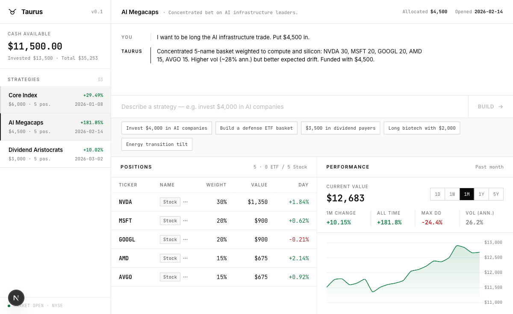
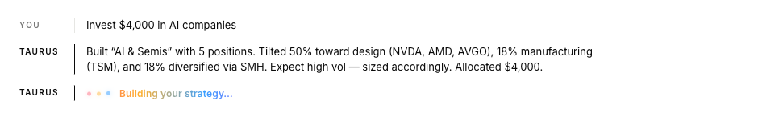

# Taurus

**Prompt-driven investing.** Describe a strategy in plain English — "invest $4,000 in AI companies" — and Taurus's AI agent designs a weighted stock basket, funds it from your paper account, executes the orders, and then manages the portfolio on a daily schedule.

**Live:** https://taurus-nu.vercel.app



## What it does

- **Natural-language strategy generation.** A Gemini-powered generator turns a prompt into a declarative `StrategySpec` — a basket of stocks with target weights, entry prices, a rebalance rule, and a cash reserve. Nothing is persisted until you confirm the spec ("ETF on demand").
- **Deterministic paper-trading engine.** A dependency-injected execution engine fills orders against real market prices, tracks positions, average entry price, and cash, and is idempotent per (strategy, account, day) so scheduler retries never double-fill.
- **Autonomous portfolio agent.** A daily cron drives a Gemini tool-calling loop (`get_quote`, `get_positions`, `get_cash`, `get_strategies`, `place_order`) that reviews each account and acts. Guardrails — max orders per run, max order notional, long-only — are enforced in code, not by the prompt.
- **Real market data.** Quotes come from Zerodha Kite Connect when a session token is present, with Alpha Vantage as the fallback source, behind a common `MarketDataProvider` interface.
- **Optional live execution.** With `KITE_LIVE_TRADING=true`, buy orders route to Zerodha as real regular/AMO orders instead of paper fills. Off by default; everything else stays paper.
- **Per-user isolation.** Supabase handles auth and Postgres storage; every server action verifies the session and scopes strategies, accounts, orders, positions, and agent runs to the signed-in user. Middleware refreshes sessions and gates all app routes.



## Architecture

```
frontend/                    Next.js 16 app (App Router, Turbopack)
├── src/proxy.ts             Middleware: Supabase session refresh + auth gating
├── src/app/
│   ├── (auth)/              /login, /signup
│   ├── (app)/               /dashboard, /strategies/new, /agent, /orders, /investments
│   ├── actions/             Server Actions (strategy generation, orders, agent)
│   └── api/cron/            /api/cron/run (daily strategy execution),
│                            /api/cron/agent (daily agent run) — Vercel crons
└── src/lib/
    ├── domain/              Shared types: StrategySpec, ExecutionEngine, MarketDataProvider
    ├── gemini/              Throttled Gemini client + basket generation
    ├── agent/               Agent harness (one model call per iteration) + tools
    ├── engine/              Paper-trading engine: allocation, order math, accounting
    ├── market/              Kite + Alpha Vantage market-data providers
    ├── kite/                Kite Connect orders, holdings sync, rate limiting
    └── supabase/            Server/browser/service clients, generated DB types

supabase/                    Generated database types
data/                        Price-ingestion and Kite login scripts (Python)
docs/                        Kite Connect API reference
```

Data lives in Supabase Postgres: `profiles`, `paper_accounts`, `strategies`, `strategy_legs`, `orders`, `trades`, `positions`, `agent_runs`, `agent_memories`, `broker_connections`, `instruments`.

## Tech stack

- **Next.js 16** (App Router, Server Actions, Turbopack) + **React 19** + **TypeScript**
- **Supabase** — auth (`@supabase/ssr`) and Postgres
- **Google Gemini** (`@google/genai`) — strategy generation and the agent loop
- **Zerodha Kite Connect** — live quotes, holdings, and optional live order routing
- **Alpha Vantage** — fallback market data
- **Chart.js** — performance charts
- **Zod** — runtime validation
- **Vercel** — hosting and cron scheduling (`vercel.json`)

## Local setup

```bash
git clone https://github.com/Ishaannarang22/taurus.git
cd taurus/frontend
npm install
cp .env.example .env.local   # then fill in the values
npm run dev
```

Required env vars (see `frontend/.env.example`):

| Variable | Purpose |
| --- | --- |
| `NEXT_PUBLIC_SUPABASE_URL`, `NEXT_PUBLIC_SUPABASE_ANON_KEY` | Supabase client |
| `SUPABASE_SERVICE_ROLE_KEY` | Server-side writes (never exposed to the client) |
| `GEMINI_API_KEY` | Strategy generation + agent |
| `ALPHA_VANTAGE_API_KEY` | Fallback market data |
| `KITE_API_KEY`, `KITE_ACCESS_TOKEN` | Kite quotes/holdings (optional) |
| `KITE_LIVE_TRADING` | `true` routes real orders to Zerodha — leave unset for paper |
| `CRON_SECRET` | Authorizes the Vercel cron endpoints |

Useful commands (from `frontend/`):

```bash
npm run build      # production build
npm run typecheck  # tsc --noEmit
npm test           # node:test suite (125 tests)
```

Deploy: `vercel --prod` from the repo root (the Vercel project's root directory is `frontend`).
