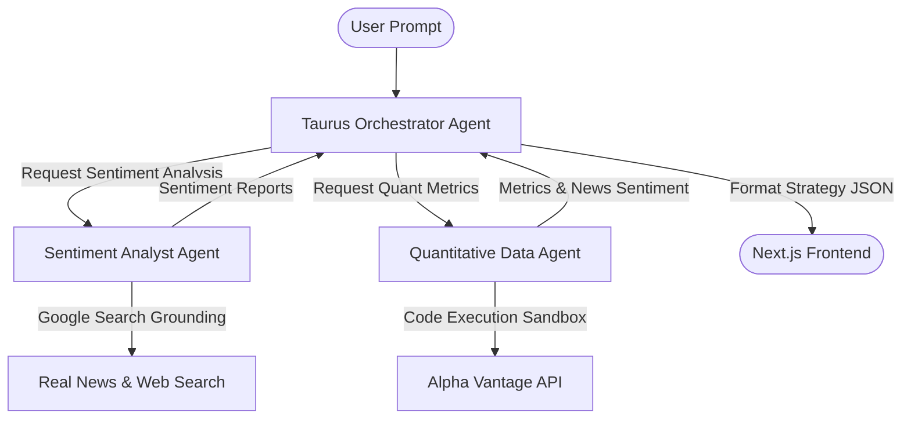

# Multi-Agent Architecture for Taurus using Google AI Studio Managed Agents

This document outlines the architecture and implementation plan to replace/extend the single-agent pipeline in Taurus with a **Multi-Agent system** using **Google AI Studio Managed Agents** (Interactions/Agents API).

---

## 1. System Architecture

The multi-agent system is composed of three specialized agents operating in Google's managed sandbox runtime, sharing context via a stateful interaction loop.



1. **Taurus Orchestrator Agent (Lead Agent):** Coordinates the execution, delegates tasks to the sub-agents, merges qualitative sentiment with quantitative data, and outputs the final structured JSON portfolio.
2. **Sentiment Analyst Agent:** Uses **Google Search Grounding** to gather real-time news, analyst ratings, and macro sentiment for specific sectors or companies.
3. **Quantitative Data Agent:** Has access to a python environment (or custom tools) to query **Alpha Vantage** for real-time price quotes, historical data, and technical indicators.

---

## 2. Defining the Agents

We will define these agents programmatically using the `@google/genai` client-side setup in Next.js.

### Agent 1: Sentiment Analyst (Grounding Tool)
This agent is configured with the `google_search` tool enabled so it can fetch the latest news from the web.

```javascript
// Define the Sentiment Analyst
const sentimentAgent = await client.agents.create({
  id: "taurus-sentiment-analyst",
  base_agent: "antigravity-preview-05-2026",
  description: "Analyzes financial news and search grounding for stock sentiment.",
  system_instruction: \`You are a Senior Sentiment Analyst. 
Your job is to search the web for the latest financial news, analyst ratings, and public sentiment for given tickers or sectors. 
Determine whether the sentiment is bullish, bearish, or neutral, and summarize the key drivers.\`,
  tools: [{ type: "google_search" }]
});
```

### Agent 2: Quantitative Data Agent (Alpha Vantage & Code Sandbox)
This agent will run in a **remote environment** with code execution enabled. It can write Python script dynamically to query Alpha Vantage API and parse JSON metrics.

```javascript
// Define the Quant Analyst
const quantAgent = await client.agents.create({
  id: "taurus-quant-analyst",
  base_agent: "antigravity-preview-05-2026",
  description: "Fetches technical indicators and metrics from Alpha Vantage.",
  system_instruction: \`You are a Quantitative Financial Analyst. 
You write Python code in your sandbox to fetch data from Alpha Vantage's endpoints.
Endpoints:
- GLOBAL_QUOTE (for real-time price)
- OVERVIEW (for key ratios)
- NEWS_SENTIMENT (Alpha Vantage's news sentiment feed)

The Alpha Vantage API Key is available in the environment as ALPHA_VANTAGE_KEY.
Always write clean Python scripts to pull data, parse it, and return a clean summary.\`,
  base_environment: "remote", // Provisions sandbox with code execution and internet access
  tools: [{ type: "code_execution" }] // Allows the agent to run Python code to call Alpha Vantage
});
```

### Agent 3: Taurus Orchestrator (Structured JSON Outputs)
This agent coordinates the inputs from the above sub-agents and generates the final strategy basket.

```javascript
const orchestratorAgent = await client.agents.create({
  id: "taurus-orchestrator",
  base_agent: "antigravity-preview-05-2026",
  description: "Coordinates portfolio construction.",
  system_instruction: \`You are the lead Portfolio Manager (Taurus). 
You coordinate the Sentiment Analyst and the Quant Analyst. 
Receive their reports, combine their findings, and format the output into the final structured strategy JSON.\`,
  // The schema is the same structure expected by frontend/src/app/page.js
  responseSchema: strategySchema, 
  responseMimeType: "application/json"
});
```

---

## 3. Implementing the Multi-Agent Flow in the Next.js API

Create or update `/src/app/api/build-strategy/route.js` to manage the multi-agent execution loop.

```javascript
import { NextResponse } from "next/server";
import { GoogleGenAI } from "@google/genai";
import { supabaseServer } from "@/lib/supabase/server";

const client = new GoogleGenAI({ apiKey: process.env.GOOGLE_GENAI_API_KEY });

export async function POST(req) {
  const supabase = await supabaseServer();
  const { data: { user } } = await supabase.auth.getUser();
  if (!user) return NextResponse.json({ error: "unauthorized" }, { status: 401 });

  const { prompt } = await req.json();
  if (!prompt?.trim()) return NextResponse.json({ error: "empty prompt" }, { status: 400 });

  // 1. Get available user cash
  const { data: wallet } = await supabase.from("wallets").select("cash").eq("user_id", user.id).single();
  const cash = Number(wallet?.cash ?? 0);

  // 2. Start a stateful session (Interaction) with the Sentiment Analyst
  const sentimentInteraction = await client.interactions.create({
    agent: "taurus-sentiment-analyst",
    input: \`Search and analyze news sentiment related to: "\${prompt}". Suggest 3-5 tickers that fit this thesis and rank them by sentiment score.\`
  });
  const sentimentReport = sentimentInteraction.output_text;

  // 3. Start a stateful session (Interaction) with the Quant Analyst
  const quantInteraction = await client.interactions.create({
    agent: "taurus-quant-analyst",
    input: \`Using Alpha Vantage API (Key: \${process.env.ALPHA_VANTAGE_KEY}), fetch the 1-month returns, PE ratio, and global quote for these tickers mentioned in this report:\\n\\n\${sentimentReport}\`
  });
  const quantReport = quantInteraction.output_text;

  // 4. Pass both reports to the Orchestrator to output the final portfolio JSON
  const finalInteraction = await client.interactions.create({
    agent: "taurus-orchestrator",
    input: \`Available Cash: \$\${cash}
    Original Thesis: \${prompt}
    
    Please combine these reports to build a strategy and return the JSON:
    Sentiment Report: \${sentimentReport}
    Quant Report: \${quantReport}\`
  });

  const payload = JSON.parse(finalInteraction.output_text);

  // 5. Save the generated strategy & holdings to Supabase (same as single agent)
  const invested = Math.min(Number(payload.invested), cash);
  const { data: strategy, error: sErr } = await supabase
    .from("strategies")
    .insert({
      user_id: user.id,
      name: payload.name,
      prompt,
      invested,
      drift: 0.0004, 
      vol: 0.01, 
      seed: Math.floor(Math.random() * 1e6),
    })
    .select()
    .single();

  if (sErr) return NextResponse.json({ error: sErr.message }, { status: 500 });

  const holdingsRows = payload.holdings.map((h) => ({ ...h, strategy_id: strategy.id }));
  await supabase.from("holdings").insert(holdingsRows);

  // Store the rich reasoning text in the chat logs
  await supabase.from("messages").insert([
    { strategy_id: strategy.id, role: "you",    body: prompt },
    { 
      strategy_id: strategy.id, 
      role: "taurus", 
      body: \`**Thesis analysis:** \${payload.rationale}\\n\\n**Sentiment Findings:**\\n\${sentimentReport}\\n\\n**Quantitative Metrics (Alpha Vantage):**\\n\${quantReport}\\n\\nAllocated \$\${invested.toLocaleString()}.\` 
    },
  ]);

  await supabase.from("wallets").update({ cash: cash - invested }).eq("user_id", user.id);

  return NextResponse.json({ strategyId: strategy.id });
}
```

---

## 4. Key Advantages for the Google I/O Hackathon

1. **Stateful Interaction Sessions:** Rather than passing massive system prompts and chat history back and forth, the `interactions.create` API allows Google AI Studio to maintain the conversation context and agent state on Google's infrastructure.
2. **Sandbox Isolation:** Running the Quant Agent in `base_environment: "remote"` gives it a secure Linux sandbox with execution capabilities. It can run dynamic scripts to retrieve Alpha Vantage APIs securely and parse the data before presenting it.
3. **Google Search Grounding:** The Sentiment Analyst leverages built-in search grounding tools, ensuring up-to-the-minute stock news is referenced rather than stale training data.